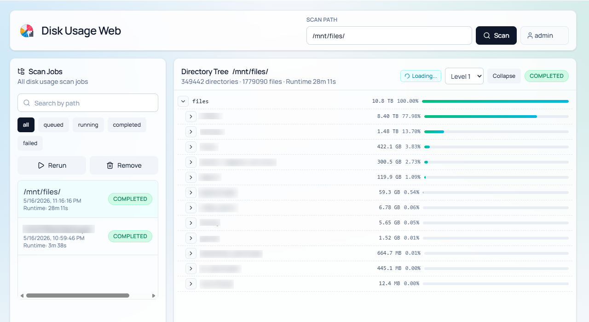
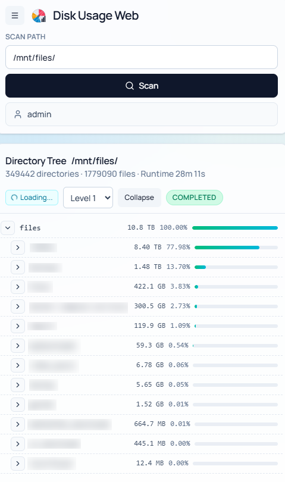

# Disk Usage Web
[](https://opensource.org/licenses/MIT) 
[](#)
[](#)
[](#)
[](#)


Disk Usage Web is a brwoser-based version of the famous `du`command, that allows scanning directories and exploring disk usage visually.

It is intended for cases where you want a simple web UI instead of repeatedly running shell tools by hand.

## Screenshots
**Desktop:**



**Mobile:**



## Technologies Used

A small overview of the main frameworks and runtime pieces:

- TypeScript: typed frontend and backend code
- React: frontend UI
- Vite: frontend build tooling and development tooling
- Express: backend HTTP API
- SQLite: local persistence for scan jobs and tree data
- Docker and Docker Compose: packaging and running the application

## How To Run

This project is intended to be run with Docker.

### Prerequisites

You need:

- Docker
- Docker Compose
- a host directory you want to scan

### Start The Application

From the repository root, run:

```bash
docker compose up --build
```

Once the containers are up, open:

```text
http://localhost:8080/duweb
```

The default URL path is `/duweb`.

## How Paths Work

The application can only scan directories that are mounted into the container.

In the current compose file, the main scan mount is:

```yaml
- /mnt/files/:/mnt/files/
```

That means paths you enter in the UI must be container paths, for example:

- `/mnt/files`
- `/mnt/files/projects`
- `/mnt/files/team/shared`

If a path is not mounted into the container, the app will not be able to scan it.

## Configuration

Most users only need to adjust two things:

- which host directory is mounted into the container
- whether authentication is enabled

### 1. Choose What Can Be Scanned

Edit [docker-compose.yml](/home/knom/duweb/docker-compose.yml) and change the bind mount under the `duweb` service.

Current example:

```yaml
volumes:
  - ./data/:/app/server/data
  - /mnt/files/:/mnt/files/
```

If the real directory you want to scan is somewhere else, replace `/mnt/files/` on the left-hand side.

Example:

```yaml
volumes:
  - ./data/:/app/server/data
  - /srv/storage/:/mnt/files/
```

After changing the mount, restart the application:

```bash
docker compose up --build
```

### 2. Change The URL Base Path

By default, the app is served at `/duweb`.

If you want a different subpath, update `BASE_PATH` in [docker-compose.yml](/home/knom/duweb/docker-compose.yml):

```yaml
environment:
  BASE_PATH: /duweb
```

If you change it to:

```yaml
environment:
  BASE_PATH: /disk-usage
```

then the app will be available at:

```text
http://localhost:8080/disk-usage
```

### 3. Authentication Options

Authentication is optional.

If disabled, anyone who can reach the app can use it.

If enabled, the server expects identity headers from a reverse proxy or ingress.

Useful settings in [docker-compose.yml](/home/knom/duweb/docker-compose.yml):

- `REQUIRE_AUTH=true`
- `REQUIRE_AUTH_GROUP=<group-name>`
- `AUTH_HEADER_USERNAME`
- `AUTH_HEADER_GROUPS`
- `AUTH_HEADER_EMAIL`
- `AUTH_HEADER_NAME`
- `AUTH_HEADER_UID`

Example:

```yaml
environment:
  REQUIRE_AUTH: "true"
  REQUIRE_AUTH_GROUP: "diskusage-admins"
  AUTH_HEADER_USERNAME: x-forwarded-user
  AUTH_HEADER_GROUPS: x-forwarded-groups
```

This is useful when the app is deployed behind something like an ingress, SSO proxy, or authentication gateway.

## Persistent Data

Disk Usage Web stores job history and scan trees in SQLite inside the container.

The compose file persists that data with:

```yaml
- ./data/:/app/server/data
```

That means your job history is stored on the host in:

- `./data`

If you remove that folder, you remove the saved scan history.

## Health Checkpoint / Monitoring

Disk Usage Web exposes a simple health endpoint you can use for monitoring, container checks, or reverse-proxy probes.

Health endpoint:

- `GET /duweb/api/health` when using the default `BASE_PATH=/duweb`

Example:

```bash
curl http://localhost:8080/duweb/api/health
```

Expected response:

```json
{"ok":true}
```

What this is useful for:

- verifying that the web server is up
- checking that the container is responding after startup
- wiring liveness or readiness checks in a reverse proxy, orchestrator, or external monitoring system

If you change `BASE_PATH`, update the health URL to match that path.

The Docker compose setup already uses this endpoint as its built-in container health check.

## Updating Or Restarting

To rebuild and restart after configuration changes:

```bash
docker compose up --build
```

To stop the application:

```bash
docker compose down
```

## Troubleshooting

### The app opens, but scans fail

Most often this means the path you entered is not available inside the container.

Check:

- the host directory mount in [docker-compose.yml](/home/knom/duweb/docker-compose.yml)
- the path you entered in the UI
- file permissions on the mounted directory

### I changed the mount but still do not see the expected files

Rebuild and restart the stack:

```bash
docker compose up --build
```

### The app is not at the URL I expected

Check the configured `BASE_PATH` in [docker-compose.yml](/home/knom/duweb/docker-compose.yml).

Default:

```text
http://localhost:8080/duweb
```

## How To Run As Developer

If you want to work on the application locally without Docker, run the frontend and backend separately.

### Prerequisites

- Node.js 22
- npm

### Install dependencies

Install dependencies in both packages:

```bash
cd server && npm ci
cd ../client && npm ci
```

### Start the backend

```bash
cd server
npm run dev
```

This starts the API on:

```text
http://localhost:3001
```

### Start the frontend

In a second terminal:

```bash
cd client
npm run dev
```

This starts the frontend dev server on:

```text
http://localhost:5173
```

In development, Vite proxies API requests to the backend automatically.

### Developer notes

- frontend dev server: `http://localhost:5173`
- backend API: `http://localhost:3001/api`
- local SQLite database: `server/data/jobs.sqlite`

### Useful developer commands

Backend:

```bash
cd server
npm run dev
npm run build
npm run test
```

Frontend:

```bash
cd client
npm run dev
npm run build
npm run test:unit
npm run test:e2e
```

Root verification:

```bash
npm run check
```

## Repository Layout

```text
.
├── client/              React frontend
├── server/              Express API and SQLite-backed scan storage
├── Dockerfile           Production image build
├── docker-compose.yml   Container runtime configuration
└── data/                Local persisted application data after first run
```
